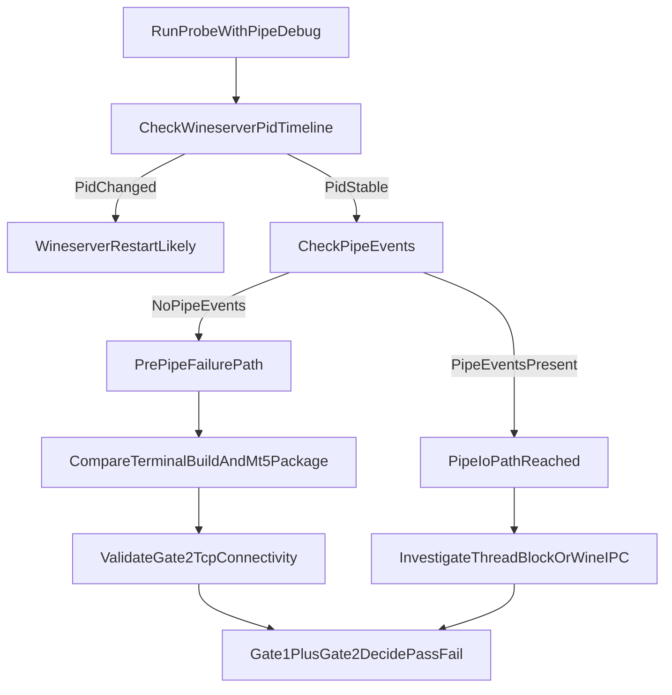

# MT5 IPC `-10005` Debug Log

## Goal
Run `terminal64.exe` headlessly inside Wine/Docker so that a Python process can call `MetaTrader5.initialize()` and get `ok=True` — proving the IPC channel is healthy and the image is ready for live trading.

---

## The Core Error: `-10005 IPC timeout`

```
ok=False err=(-10005, 'IPC timeout') version=None
```

The Python `MetaTrader5` package connects to the terminal via a Windows named pipe.  
`-10005` means: **pipe found, connection opened, but the terminal never sent a response within the timeout.**

This is distinct from:
- `-10003` → pipe not found at all (terminal not running or wrong path)
- `exception: ...` → Python-side crash

---

## Architecture

```
[Linux smoke-test container]
        │
        │  wine python.exe -c "import MetaTrader5; mt5.initialize()"
        │         │
        │         │  Windows named pipe  \\.\pipe\MetaTrader5.{PID}
        │         │  (routed through wineserver — same WINEPREFIX)
        │         ▼
        │  [terminal64.exe — Wine process]
        │         │
        │         │  broker TCP connection
        │         ▼
        │  [Exness-MT5Trial9 servers]
        │
        └─ Both wine processes share same wineserver (/opt/wineprefix)
```

---

## Root Cause Investigation Timeline

### Attempt 1 — Shell timeout too short
**Symptom:** `probe_exit=124` (shell killed wine before Python could return)  
**Fix:** Raised shell `timeout 45s` > Python `timeout=30000ms`  
**Result:** `probe_exit=3` (-10005) — Python now returns properly but still fails

---

### Attempt 2 — Broker auth blocking
**Hypothesis:** `mt5.initialize(login, password, server)` waits for full broker roundtrip  
**Fix:** Split into:
- GATE 2 (fatal): `mt5.initialize()` — no credentials, IPC-only
- GATE 3 (non-fatal): `mt5.initialize(login, password, server)` — broker check
**Result:** Still `-10005` on no-credentials probe. Broker auth is NOT the cause.

---

### Attempt 3 — mt5-bridge (REST API)
**Hypothesis:** Use `mt5-bridge` (PyPI) to run a FastAPI server inside Wine, expose HTTP  
**Discovery:** `mt5-bridge` requires **Python ≥ 3.11**. Wine Python is **3.9**.  
**Result:** `No module named mt5_bridge` — install silently failed due to `|| true`  
**Fix:** Reverted to direct IPC probe

---

### Attempt 4 — LiveUpdate dialog blocking the main thread
**Evidence from logs:**
```
[smoke-dismiss iter=1] wid=16777245 name=Welcome to LiveUpdate
[attempt 1/20] probe_exit=3 probe_out=ok=False err=(-10005, 'IPC timeout')
```
- Dialog appears ~120-130s after terminal start
- After dismiss iter=1 fires: `windows=` is EMPTY on all subsequent attempts
- But IPC is STILL `-10005` for all 20 attempts (10 minutes)

**Hypothesis:** `terminal64.exe` calls `CreateProcess(liveme.exe)` + `WaitForSingleObject`,  
blocking the main thread until LiveUpdate exits. Since the dialog requires user input, it never exits.

**Fix attempted:** Delete `liveme.exe` from the MT5 install directory  
**Result:** `liveme.exe removed (or was never present)` — **liveme.exe doesn't exist as a separate file**. LiveUpdate is built into `terminal64.exe` itself as an internal thread calling `DialogBox()` on the main thread.

---

### Attempt 5 — Suppress LiveUpdate via terminal.ini + registry
**Fix (3-layer approach):**
1. `terminal.ini` → `[Common] AutoUpdate=0`
2. `terminal.ini` → `[LiveUpdate] Enabled=0` + `NextUpdate=9999999999`
3. Wine registry → `HKCU\Software\MetaQuotes\Terminal5\LiveUpdate = 0`

Applied to 4 locations: portable `terminal.ini`, AppData hash-dir `terminal.ini`, `config/common.ini`, Wine registry

**Result:** Dialog **still appears** — MT5 ignores all these settings.

```
[smoke-dismiss iter=1] wid=16777245 name=Welcome to LiveUpdate   ← still there
[attempt 1/20] probe_exit=3 probe_out=ok=False err=(-10005, 'IPC timeout')
```

---

### Attempt 6 — Better dismiss + explicit path= + pipe debug *(current)*

**Problem A: Dismiss might not be working**  
`Alt+F4` via xdotool may not properly route `WM_SYSCOMMAND SC_CLOSE` through Wine's event handling for modal dialogs.

**Fix:** Switch to `Escape` (maps directly to `IDCANCEL`) + `Return` (default button) + mouse click at 75%/85% of dialog coordinates (targets "Later" button position).

**Problem B: `mt5.initialize()` without `path=` may fail silently**  
Without `path=`, the Windows MetaTrader5 package searches the registry for the terminal executable. In Wine, this registry key may be empty or wrong → can't resolve the pipe endpoint → falls back to -10005 instead of -10003.

**Fix:** Build explicit Windows path from `TERM_EXE`:
```bash
TERM_WIN_PATH=$(echo "${TERM_EXE}" \
  | sed 's|/opt/wineprefix/drive_c/|C:\\|' \
  | sed 's|/|\\|g')
# → C:\Program Files\MetaTrader 5\terminal64.exe
```
Pass as: `mt5.initialize(path=r'C:\Program Files\MetaTrader 5\terminal64.exe', timeout=10000)`

**Problem C: No visibility into what the pipe is actually doing**  
**Fix:** `WINEDEBUG=+pipe` on the probe process → shows all pipe open/connect/read/write events.

---

## What the WINEDEBUG=pipe output will tell us

| Output pattern | Meaning | Next action |
|---|---|---|
| No `pipe:` lines at all | MetaTrader5 didn't even try to open a pipe — registry/path issue | Verify `TERM_WIN_PATH` is correct |
| `pipe:open_named_pipe` then 10s silence | Pipe found, terminal not dequeuing — thread blocked | LiveUpdate is real cause; need different dismiss |
| `pipe:open_named_pipe ... pipe:ReadFile` then timeout | Pipe connected, response never came | Wine cross-process pipe bug or shared memory issue |
| `probe_exit=0` | Fixed ✓ | Proceed to production |

---

## Fallback Plan (if path= + pipe debug don't resolve it)

If `-10005` persists even with explicit path and WINEDEBUG shows the pipe IS connecting:

### Option A: mt5linux server architecture
Run MetaTrader5 inside Wine as a **TCP server** (same Wine process as terminal, so IPC is native), probe from Linux via TCP:
```bash
# Wine side (starts server on :18812, connects to terminal natively)
wine python.exe -m mt5linux &

# Linux side (TCP proxy — no cross-process Wine IPC)
python3 -c "
from mt5linux import MetaTrader5
mt5 = MetaTrader5('127.0.0.1', 18812)
print(mt5.initialize())
"
```
**Requires:** `pip3 install mt5linux` in the system Python (Dockerfile `RUN pip3 install mt5linux`)

### Option B: MQL5 EA HTTP server
Deploy an Expert Advisor inside the terminal that exposes a REST API on port 8080.  
Probe: `curl http://127.0.0.1:8080/health`  
No Python IPC at all — pure HTTP from both sides.  
**Requires:** Compiling and deploying a custom EA (complex build step).

### Option C: Accept LiveUpdate, wait it out
Extend the smoke test startup wait from 120s → 600s (10 min).  
LiveUpdate may auto-close after its network timeout expires if update domains are blocked.  
Test: set a very long first `sleep` and see if IPC works after LiveUpdate times out naturally.

---

## Current State (commit `62c3887`)

| Layer | Status |
|---|---|
| terminal64.exe alive after 120s | ✅ GATE 1 always passes |
| LiveUpdate suppressed via ini/registry | ❌ Dialog still appears |
| Dismiss via Escape+Return+mouse | 🔄 Testing in current build |
| Explicit `path=` in probe | 🔄 Testing in current build |
| `WINEDEBUG=+pipe` diagnostics | 🔄 Will show in next log |
| `mt5.initialize()` returns `ok=True` | ❌ GATE 2 never passes |

---

## Updated Interpretation (latest)

- If `WINEDEBUG=+pipe` shows **no** `pipe:` events while probe still returns `-10005`, the failure is likely **before named-pipe I/O**.
- This points to discovery/compatibility issues (terminal build identity, executable lookup context, package/build mismatch), not transport-level pipe timeout.
- Smoke-test pass criteria should stay:
  - **GATE 1:** terminal process alive
  - **GATE 2 (fatal):** external broker TCP established
  - **GATE 3 (non-fatal):** Python IPC probe for diagnostics

## Troubleshooting Decision Tree


